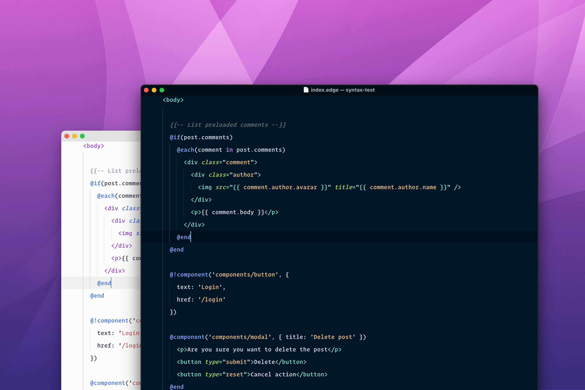
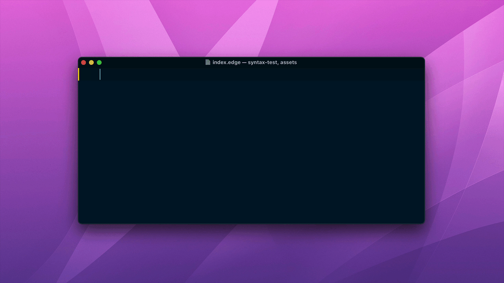
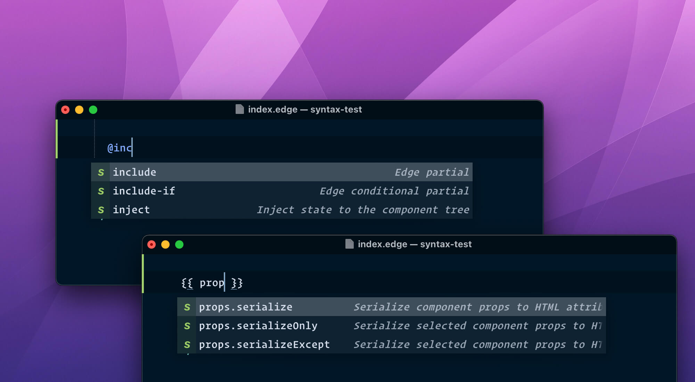
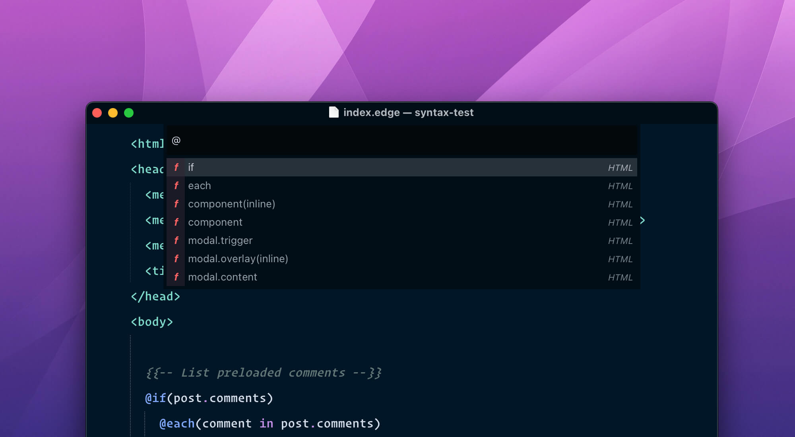

  

  <h2> Edge templates extension for Sublime Text </h2>

 

 

This is the official extension for Sublime text created by the creators of Edge.js. Along with **syntax highlighting**, the extension adds support for following items.

## Installation
Install the package from the Package control by searching for "Edge templates extension"

## Edge spacer
Automatically adds the whitespace in between the mustache braces `{{ }}`. The extension code is borrowed from [austenc/blade-spacer](https://github.com/austenc/blade-spacer), so credit goes to them.

## Completions
The extensions adds support for completion of known tags and global variables. It is based off the sublime completions file.

## Symbols
All of the edge tags shows up inside the Sublime symbols list. You can quickly nagivate between them.

## Other
- The extension works perfectly with existing HTML shortcuts or completions provided by Sublime
- The extension works with Emmet as well. No additional configuration required
- It requires `Packages/HTML/HTML.sublime-syntax` and `Packages/JavaScript/JavaScript.sublime-syntax` syntax files. Both are pre-installed with Sublime text, unless you have removed them manually.
